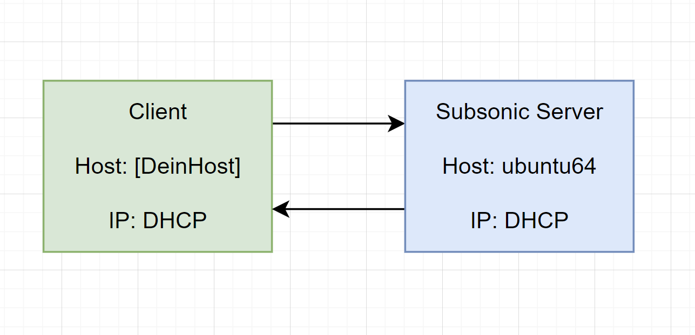

# Modul 300 LB2 Dokumentation

## Inhaltsverzeichnis
- [Grafische Übersicht](#Grafische-Übersicht) 
- [Einleitung des Projekts](#Einleitung-des-Projekts) 
- [Beschreibung des Dienstes](#Beschreibung-des-Dienstes) 
- [VM/Dienst starten](#VMDienst-starten) 
- [Auf Dienst/Service zugreifen](#Auf-DienstService-zugreifen) 
- [Sicherheit](#Sicherheit) 
- [Tests](#Tests) 
- [Quellenangabe](#Quellenangabe) 

 

## Grafische Übersicht

 

## Einleitung des Projekts
In diesem Projekt geht es darum per Vagrant File eine VM zu erstellen, welche einen Service bietet, der nach dem 'vagrant up' direkt ausserhalb der VM verfügbar ist. Ich habe mich in diesem Projekt für einen Subsonic-Server entschieden. Die VM übernimmt dabei die Konfigurationen für den Subsonic-Server und downloaded diesen automatisch.

 

## Beschreibung des Dienstes
  * Subsonic Server mit html page
  * Relevante Config-Files
  * Von aussen ist der Dienst über jeglichen Browser verfügbar (Edge, Firefox, etc...)
  * VM befindet sich in einem Private Network und ist somit nur über das eigene Netz und nicht über ein anderes Netz erreichbar

 

## VM/Dienst starten
    cd 'Pfad in dem sich das Vagrantfile befindet'
    vagrant up

 

## Auf Dienst/Service zugreifen
    Im Browser folgenden Befehl in der Adresszeile eingeben: https://[dhcp_adresse]:4040
    Benutzer: vagrant
    Passwort: vagrant

 

## Sicherheit
* Sowohl der Benutzername des Hosts, als auch das Passwort heisst 'vagrant'
* Der Benutzername und Passwort des Subsonic Benutzers ist admin
* VM befindet sich in einem Private Network und ist somit nur über das eigene Netz und nicht über ein anderes Netz erreichbar

 

## Tests
* Getestet wurde der Dienst mit Firefox, Chrome und Opera
* Test lief erfolgreich über Firefox, Chrome und Opera
* Service ist über die Adresszeile https://[dhcp_adresse]:4040 erreichbar

 

## Quellenangabe

| Beschreibung      | Quelle          |
| --------------| -----------------|
| Installationsanleitung | https://www.linuxbabe.com/ubuntu/install-subsonic-media-server-ubuntu-18-04-https |
| Allgemeiner Vagrant-Syntax | Vagrant Beispiele aus der M300-Dokumentation  |
| allgemeinr Markdown-Syntax | https://www.markdownguide.org/basic-syntax/ |
